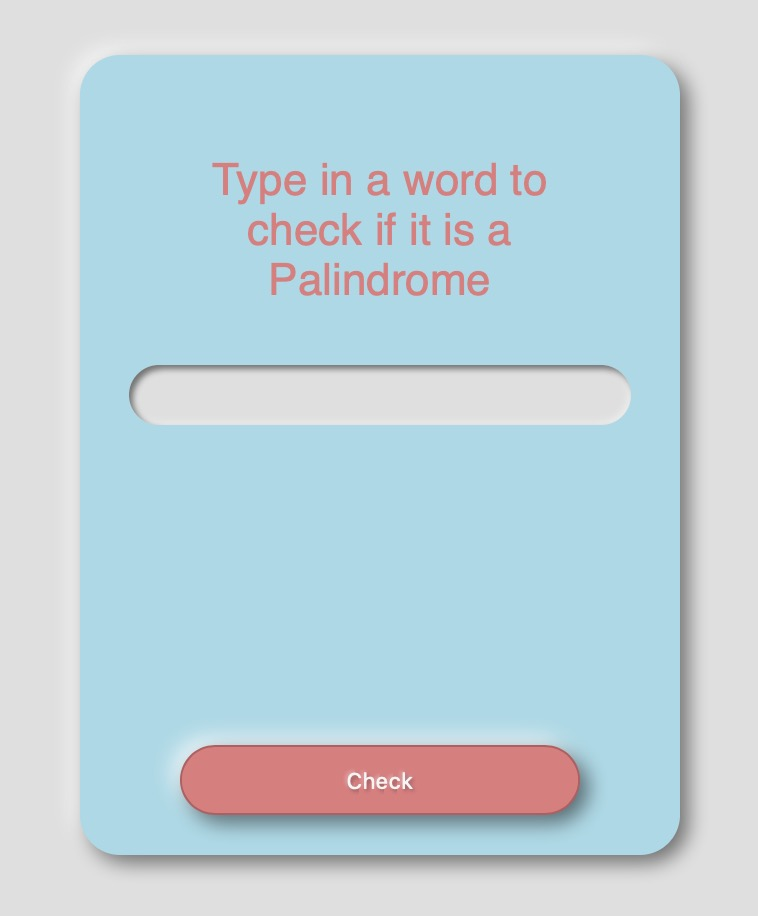

# Palindrome

## General info
A palindrome is a string where it's reversed order is exactly the same as the original. This app tests if the input is a palindrome by taking the original string, running a for loop to reverse each character. And then it goes through a If/else to test if there is a match.

## Technologies
Project created with:
* HTML5
* CSS3
* SASS
* JS ES6

## Design
This was designed in neomorphic style. 

## Challenges Faced
Overall, this was a fun little app to build. The only problem I had was dealing with the capitalizations of words. This was easily solved using the `.toLowerCase()` method.

## Launch
Test run it **[HERE](http://htmlpreview.github.io/?https://github.com/superchrisho/palindrome/blob/main/index.html)**

